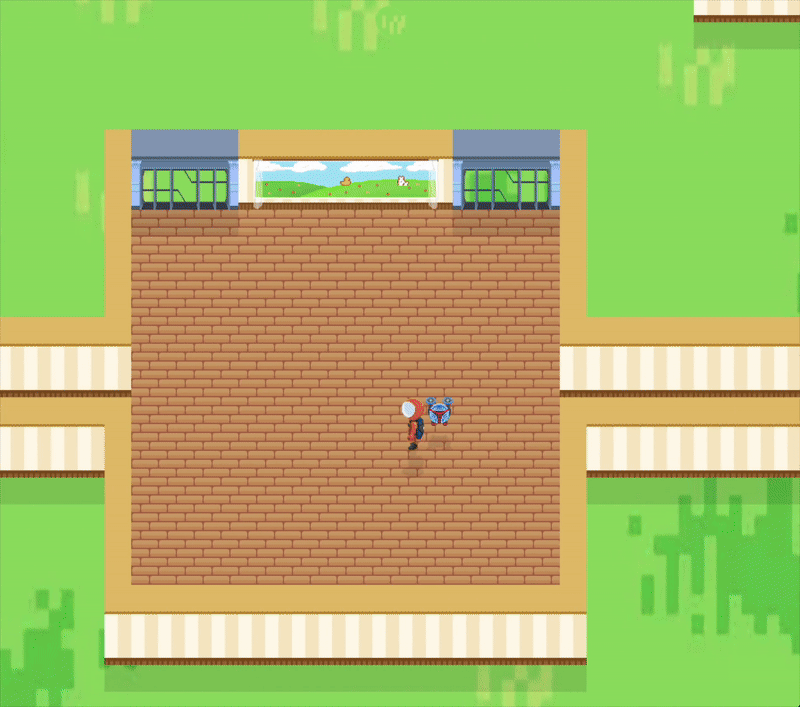
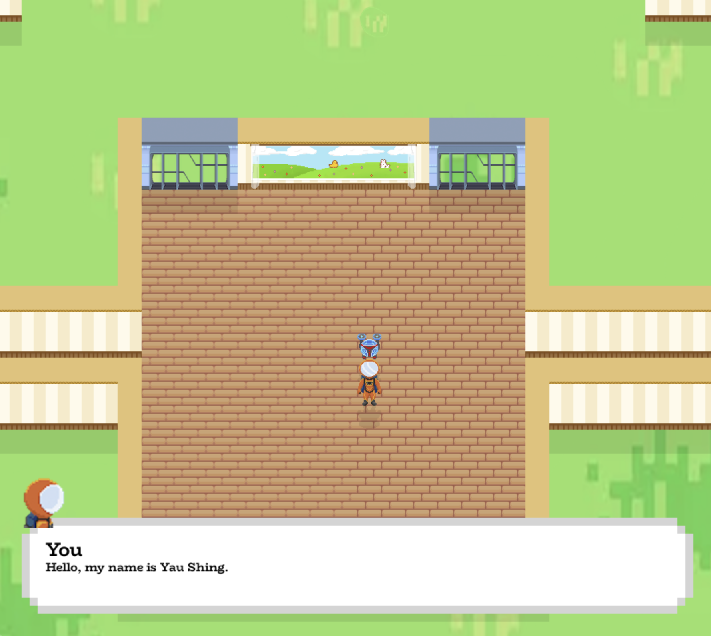
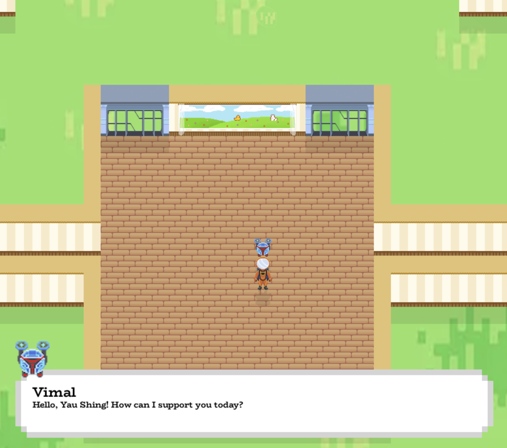
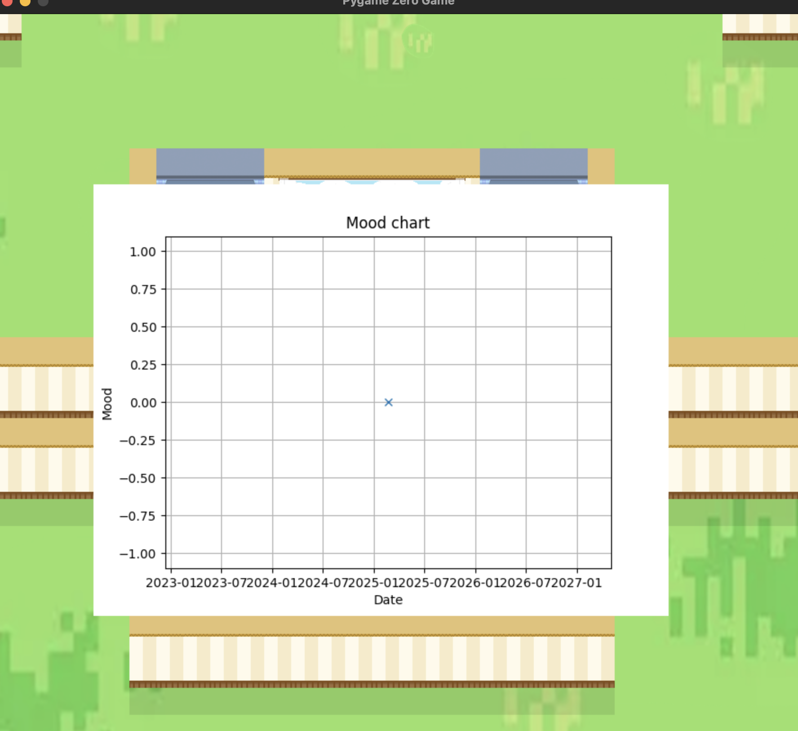
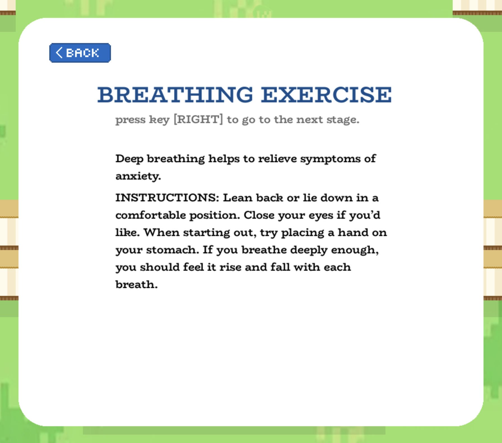
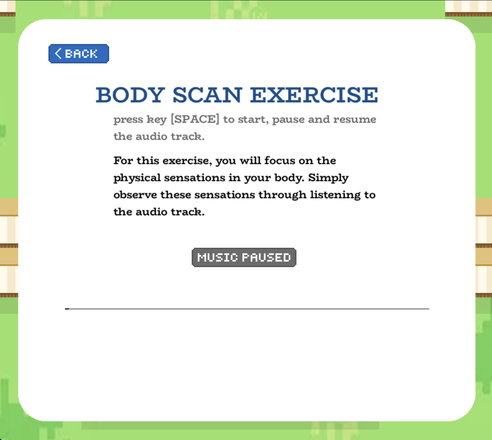

# 2024-2025 Sec 3 - 4 Coursework, Team MST6 (Nerd)

Meet AMY: An AI Therapist made for teenagers struggle with managing their stress and mental health, by teenagers struggling to manage their stress and mental health.\
Our app aims to help teenagers cope with stress and handle their mental health.  Teenagers will benefit from the solution. They face a multitude of problems, such as stress due to academics, relationship issues, and stress due to the forming of their identities.

## Installation

1. Download [python 3.9.12](https://www.python.org/downloads/release/python-3912/)
2. Enter terminal in the root directory of this project and run:
```zsh
pip3 install -r modules.txt
```
3. Run the following command to start a python shell:
```zsh
python3
```
4. Run the following commands in the shell:
```python3
>>> import nltk
>>> nltk.download('all')
```
4a. If you run into an error that says that SSL certificate cannot be verfied, run the following python commands:
```zsh
>>> exit()
```
4b. Run the following commands:
```zsh
/Applications/Python 3.9/Install Certificates.command
```
In place of the 3.9, put the version of Python that you used if it's an different one.\
4c. Run step 4 again.

5. Add password.py into the root directory of the project\
6. Run game.py from the root directory of the project with 
```zsh
python3 game.py
```

## Features

- Gamified UI
- Guided breathing exercises
- Guided full body scans
- Mood charts
- AI Therapist chatbot

## Issues
- There is rare bug where the game quits with the following in terminal:
```zsh
zsh: trace trap. 
```
Unfortunately there is no way to fix this as this is a problem with UNIX and the python interpreter and not the code itself. Instead, just relaunch game.

## Demo




## Screenshots








## Authors

- [@JKYS_11257](https://www.github.com/yaushing)
- [@jelly-beans3](https://www.github.com/jelly-beans3)
- [@Vimal_JustChill](https://github.com/Vimal-JustChill)


## License

[MIT](https://choosealicense.com/licenses/mit/)


## Related

Here are some related projects

[Mentalstop](https://github.com/SeansC12/mentalstop)